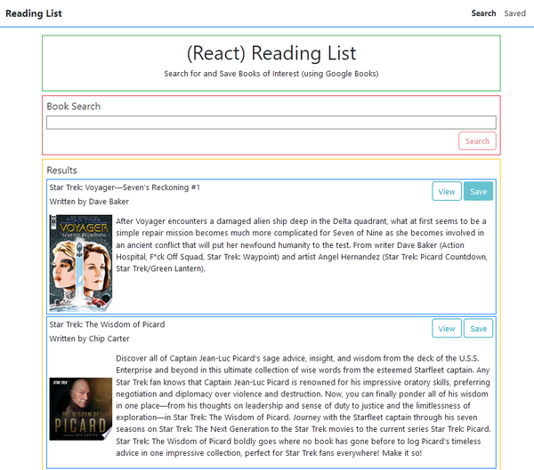
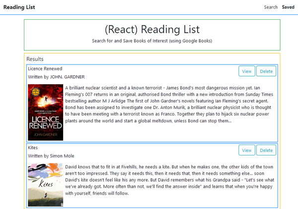

# Reading_List
This application allows users to search for and save books of interest. The Google Books API is used to get books matching the user's query. This is a full-stack MERN application i.e. it has been built using MongoDB/Mongoose, Express, React, Redux and Node. The application is deployed to Heroku. The MongoDB Database is hosted on MongoDB Atlas.

# Usage
Use the links in the navigation bar to switch between the Search and Saved pages.

On the Search page, type your query into the search box. 10 books related to your query (as determined by the Google Books API) will be displayed. Click the Save button to save a book to your 'Saved' reading list.

The search results are saved in sessionStorage. This means your search results will persist even if you toggle between the Search and Saved pages. A new search will replace the old search results. Closing your browser tab will flush the sessionStorage.

Click on the Saved link in the navigation bar to see a list of all books you've saved. You can press the Delete button to remove books from this list.

# Releases
* v1.0: [Initial Version](https://github.com/cek333/Reading_List/releases/tag/v1.0) (Dec 18, 2020)
  > **Brief data flow overview**: On the Search Page, when the user does a search, the data fetched from the API is stored in session storage. So, when the user navigates to the Saved page and then back to the Search Page, any previous search results are retrived from session storage. On the Saved Page, each time the page is loaded, an API call is made to the server to fetch the list of saved books. 
* Current version: Redux Version (Jul 11, 2021)
  > **Brief data flow overview**: On the Search Page, when the user does a search, the data fetched from the API is stored in the Redux store. When the app is first loaded, an API call is made to the server, and the list of saved books is stored in the Redux store.

# Try It
You can try the application [here](https://reading-list-45753.herokuapp.com/).